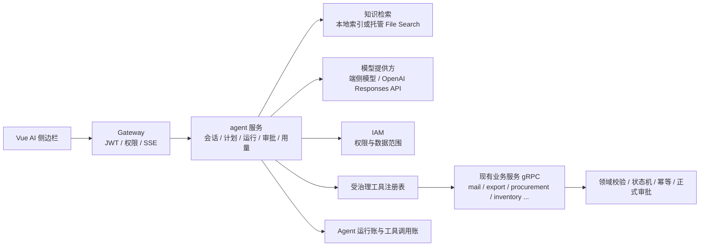

# AI Agent 融入 ERP 企划书

> 状态：提案稿  
> 日期：2026-08-28  
> 范围：产品效果、业务场景、技术架构、安全边界与衡量方式  
> 本文只做方案说明，不代表已经实现；分批任务见 [AI Agent实施计划.md](./AI%20Agent实施计划.md)。

## 一、结论先行

这个项目适合引入 AI，但不适合把 ERP 直接交给一个会“自己点页面”的黑盒。

建议把能力分成四层，逐层开放：

1. **知识助手**：阅读经过发布的说明文档，引用原文回答“怎么用、为什么、下一步是什么”。
2. **业务副驾**：结合当前页面和用户有权读取的业务数据，解释状态、定位阻塞、生成草稿与建议。
3. **受治理的行动 Agent**：把自然语言变成可预览的执行计划，通过结构化业务工具完成操作；写操作按风险要求用户确认。
4. **自动化 Agent**：按定时、事件或收件箱触发执行已批准的“配方”，持续运行并留下完整记录。

“Claw 类”浏览器/电脑操作应放在最后，只用于没有 API 的外部网站或遗留系统。ERP 内部操作必须优先调用受权限、数据范围、状态机、幂等和审批保护的领域工具，不能靠识别按钮坐标绕过业务守卫。

项目已经具备一部分好地基：

- OpenAI Responses API、严格 JSON Schema、异步任务、token 用量和租户月度额度已经在邮箱转 Excel 中落地；
- Gateway 有统一 JWT、权限码和 HTTP 幂等中间件；
- IAM 已有 `SELF / DEPT / DEPT_AND_SUB / CUSTOM / ALL` 数据范围；
- 业务服务已有状态机、领域校验、审批、Outbox、Kafka 幂等消费和 SSE 刷新；
- [开发计划.md](./开发计划.md) 已列出 C1–C6：工厂报价解析、发票 OCR、产品匹配、邮件助手、银行对账兜底和模型路由。

但也有一个必须诚实面对的缺口：架构文档中的 `audit`、`reporting` 服务目前没有出现在实际 `services/` 中。因此，Agent 在开放任何写操作前，必须先拥有自己的运行账、工具调用账和人工确认记录，不能把安全寄托在一个尚未落地的全局审计服务上。

## 二、产品定位

### 2.1 五个容易混淆的概念

| 名称 | 它做什么 | 是否能改业务数据 |
|---|---|---|
| 知识助手 | 从说明文档检索并解释功能 | 否 |
| 业务副驾 | 读取当前上下文，给分析、候选项和草稿 | 否 |
| 行动 Agent | 生成计划并调用 ERP 领域工具 | 按风险与确认策略 |
| 自动化配方 | 把已批准的触发条件、步骤和边界长期保存 | 仅限配方授权范围 |
| Claw 类 UI Agent | 在网页/桌面上观察、点击、输入 | 风险最高，仅作外部系统兜底 |

### 2.2 产品承诺

用户不需要先学会“应该进入哪个模块、点哪个按钮、读哪一段文档”，但系统仍然必须让用户知道：

- Agent 根据什么资料得出结论；
- 它准备做哪些步骤；
- 哪些步骤只是读取，哪些会产生业务后果；
- 哪一步需要谁确认；
- 最终改了什么、哪些没改、失败在哪里；
- 如何回到原始单据核对。

### 2.3 不变的总原则

沿用现有 C 组的原则，并补完整：

> **AI 出解释、候选、草稿或计划；人对业务决定负责；领域守卫对最终数据负责。**

确定性的业务流程继续写成普通代码。能用 SQL、状态机、规则表或审批流稳定表达的事情，不应为了“像 Agent”而交给模型判断。AI 只处理自然语言、非结构化文件、模糊意图、跨模块解释和需要推理的例外。

## 三、场景规划

### 3.1 用户提出的两个核心场景

#### 场景 A：说明文档问答

用户可以问：

- “为什么这张采购单不能提交？”
- “Country 是产地还是销售地？”
- “邮件附件怎么切换询价模板？”
- “主管为什么能看到这张单，却不能替负责人修改？”

效果不是返回一段搜索结果，而是：

1. 先给一句直接答案；
2. 用用户当前语言解释原因和操作路径；
3. 列出适用条件和容易踩的坑；
4. 引用具体文档、章节和发布版本；
5. 找不到可靠依据时明确说“不确定”，不编造系统能力。

#### 场景 B：困难操作代办

用户可以说：“把这封客户询盘整理成详细尺寸模板，创建待复核询盘，但不要直接发给工厂。”

Agent 应展示：

- 识别出的目标；
- 将读取哪些邮件/附件；
- 将调用哪些工具；
- 预计生成哪些草稿；
- 哪一步会写入系统；
- 执行前确认按钮；
- 执行后的单号、结果和逐步证据。

Agent 不能把“帮我处理一下”理解成无限授权，也不能顺手发送邮件、提交审批或确认付款。

### 3.2 建议新增的高价值场景

| 场景 | 示例 | 用户看到的效果 | 初始风险级别 |
|---|---|---|---|
| 页面上下文助手 | “这里的待复核是什么意思？” | 自动带入当前页面、当前单据和状态解释 | L0 只读 |
| 跨模块业务问答 | “合同 CT-xxx 走到哪了，卡在哪？” | 汇总采购、到货、出运、船期和收款，并链接原单 | L0 只读 |
| 阻塞诊断 | “为什么按钮没有出现？” | 检查权限、归属、状态、必填项和前置单据，给可执行的修复路径 | L0 只读 |
| 非结构化录入 | 工厂报价、发票、银行单、物流邮件转草稿 | 逐字段显示来源、置信提示和差异，不直接入账 | L1 草稿 |
| 产品匹配建议 | NO_MATCH 行找前三个产品/SKU | 显示匹配依据和差异，由人选择 | L1 建议 |
| 邮件副驾 | 长线程摘要、英西回复、跟进提醒 | 草稿可编辑，默认不发送 | L1 草稿 |
| 异常解释 | 三单核对异常、超量、重复、币种不一致 | 用人话说明“哪两个事实冲突、该找谁处理” | L0 只读 |
| 批量操作计划 | “给这 20 条缺资料的询盘补负责人并生成待办” | 先列影响范围与逐项预览，再分批确认 | L2 受控写入 |
| 主动风险提醒 | 即将逾期、成本异常、长期无进展 | 给风险依据和建议动作，不制造新的业务事实 | L1 建议 |
| 自动化配方 | “每天 9 点汇总我负责且 3 天内到期的事项” | 可查看触发器、范围、上次运行和下次运行 | L1–L2 |
| 管理者简报 | “本周最需要我介入的 10 件事” | 依据逾期、异常和金额排序，全部可追溯到原单 | L0 只读 |
| 数据质量巡检 | 重复主数据、空负责人、单位冲突、孤儿引用 | 输出问题清单与修复草案，不自动改账 | L1 建议 |
| 新人训练 | “带我完成一次从询盘到采购的演练” | 沙盒/演示数据中的分步教学，不碰生产数据 | L0 沙盒 |
| 运维辅助 | 解释错误码、日志与失败任务 | 关联 trace_id、运行记录和文档，给排查建议 | L0 内部用户 |

### 3.3 哪些事情不应该交给 Agent

- 根据自然语言直接改数据库；
- 绕过 Gateway、IAM、状态机或审批服务；
- 自动批准/驳回本人或他人的正式审批；
- 自动确认付款、收款、库存调整、合同签署、作废等高责任动作；
- 自动修改角色、权限、数据范围、邮箱凭据或密码；
- 把“模型觉得合理”当作金额、数量、汇率或合规事实；
- 用 UI 点击替代已经存在的领域 API；
- 在没有引用或可验证业务数据时给出肯定结论。

这些能力将来即使开放，也必须是用户本人在明确界面中完成最终决定，而不是 Agent 代替承担责任。

## 四、实现效果

### 4.1 全局入口

在现有 Shell 中增加统一的“AI 助手”入口，使用右侧面板而不是另造一套业务页面。面板包含：

- 对话区；
- 当前上下文卡片（页面、单据、已选邮件/附件）；
- 引用与数据来源；
- 执行计划；
- 待确认动作；
- 运行时间线；
- 结果、失败项与原单链接。

用户可以主动移除上下文。Agent 不应因为用户恰好打开一个页面，就默认获得读取页面中所有敏感字段的许可。

### 4.2 三种回答形态

1. **解释**：答案 + 引用 + 适用条件。
2. **建议/草稿**：结构化预览 + 来源 + 可编辑字段 + “采用”按钮。
3. **行动计划**：步骤、工具、风险、影响对象、确认点、预计结果。

### 4.3 一个完整例子

用户说：“把今天未处理的客户询盘整理好。”

Agent 不直接开始，而是把模糊意图收口：

1. 读取用户有权查看的“今天、未处理、疑似询盘”邮件；
2. 显示共找到多少封，哪些有附件；
3. 对每封给出分类与理由；
4. 让用户选择询价模板和处理范围；
5. 生成待复核草稿；
6. 对漏行、重复、无法识别尺寸等异常单独列出；
7. 用户确认后才创建待复核询盘；
8. 不发送工厂邮件、不创建采购单、不提交审批；
9. 返回成功单号和失败原因。

### 4.4 失败体验

Agent 失败时不能只说“出错了”。应区分：

- 没有权限；
- 数据不在用户范围内（按现有规则对业务对象表现为“不存在”）；
- 状态已经变化，需要重新计划；
- 同一操作正在执行；
- 模型没有按 schema 返回；
- 工具参数未通过领域校验；
- 外部模型/依赖超时；
- 需要人工补充信息。

已完成步骤和未执行步骤必须分别展示，禁止在部分失败时给出“全部完成”的总结。

## 五、技术方案

### 5.1 总体架构

建议新增独立 `agent` 服务，作为 Agent 数据与运行状态的属主；它不拥有合同、邮件、采购、库存等业务数据，也不直接读其他服务数据库。

关键边界：

- `agent` 只通过 gRPC 调用其他服务，不跨库；
- 每次工具调用都携带当前 `tenant_id`、`employee_id` 和 trace_id；
- 每次调用前重新校验权限，读取时继续执行原模块数据范围；
- Agent 暴露的业务工具必须复用现有应用用例，不能复制一份“AI 专用业务逻辑”；
- 如果某个现有写接口只在 Gateway 检查权限，开放给 Agent 前必须补齐可复用的服务端授权路径；
- 业务写入仍由所属服务完成，Outbox、事件和状态机规则保持不变。

### 5.2 为什么不把通用 Agent 塞进 mail 服务

mail 服务已有 OpenAI 接入，但它的数据属主是邮件。把全公司的合同、采购、库存 Agent 都塞进去，会造成：

- 模型配置和邮件业务绑死；
- mail 逐渐知道所有服务的接口；
- Agent 会话、审批和工具账没有清晰属主；
- 其他 AI 场景复制邮件的配额、用量和错误处理。

应提取公共的模型提供方、用量与策略概念，但不让 mail 变成“万能 AI 服务”。现有邮件转 Excel 可以先保持不动，再按批次接入公共能力。

### 5.3 Agent 运行状态

每次运行至少有以下状态：

`QUEUED → PLANNING → RUNNING → WAITING_APPROVAL → RUNNING → SUCCEEDED / PARTIAL / FAILED / CANCELLED`

长任务不能依赖浏览器连接存活。浏览器断开后任务继续，重新打开可恢复时间线；状态变化通过现有 SSE 思路只发送“去重新读取”的提示，不把敏感结果直接广播。

### 5.4 建议的数据属主

`agent` 数据库建议拥有：

- `agent_conversations`：会话标题、用户、租户和保留策略；
- `agent_messages`：用户输入与最终答复，敏感内容按策略脱敏/缩短保留；
- `agent_runs`：模型、状态、用途、token、成本、trace_id；
- `agent_steps`：计划步骤及状态；
- `agent_tool_calls`：工具名、参数摘要、结果摘要、耗时和错误码；
- `agent_approvals`：待确认内容、确认人、决定、时间和运行版本；
- `agent_automations`：触发器、范围、所有者、启停和版本；
- `knowledge_sources / knowledge_versions`：文档来源、commit SHA、受众和索引状态；
- `agent_feedback`：有帮助、无帮助、纠正内容；
- `agent_eval_cases / agent_eval_runs`：回归样例与结果。

所有表带 `tenant_id`；工具调用记录采用追加式设计。原始业务数据仍留在原服务，Agent 账只存引用与必要摘要，避免复制一套失真的业务数据库。

### 5.5 文档知识库

第一期只纳入经过审核的用户文档，不应把整个仓库源码直接暴露给普通用户。

建议将知识源分级：

| 受众 | 内容 | 普通员工可见性 |
|---|---|---|
| USER | 操作手册、字段解释、流程说明、FAQ | 按功能权限过滤 |
| ADMIN | 开户、角色、权限、配置、额度 | 仅管理员 |
| OPS | 部署、监控、故障排查 | 仅平台运维 |
| DEV | 架构、代码约定、测试策略 | 默认不向业务用户开放 |
| TENANT | 客户公司自己的 SOP/模板说明 | 仅本租户授权人群 |

索引流水线应记录 Git commit、标题层级、文档路径、章节锚点、语言和受众。回答至少返回“文档名 + 章节 + 版本”；低相关度时拒答或请求澄清。

检索可以有两种实现：

- **本地模式**：Markdown 分块 + 关键词/向量混合检索，文档和索引不离开部署环境；适合端侧模型和强隐私客户。
- **OpenAI 模式**：使用 Responses API 的 File Search/vector store 托管检索，开发快、运维轻；系统文档与各租户自定义文档必须分库或通过可靠的权限隔离，不能共用一个无过滤知识库。

### 5.6 模型策略

不要让页面自由填写模型名。管理员配置“用途 → 允许的模型档位”，例如：

| 用途 | 默认选择 | 适合内容 |
|---|---|---|
| FAQ_FAST | 本地小模型或低成本 API 模型 | 文档问答、改写、分类 |
| BUSINESS_REASONING | 高准确模型 | 跨模块诊断、复杂计划 |
| DOCUMENT_EXTRACT | 视觉/文件能力模型 | PDF、Excel、图片提取 |
| SENSITIVE_LOCAL | 端侧模型 | 不允许离开本地的内容 |

路由策略、模型价格、token 用量、次数额度和费用上限必须是公共能力。现有 C6 的顺序仍然成立：**先按模型正确计价，再开放多模型路由**。

### 5.7 工具设计

模型不接触任意 HTTP、SQL 或 shell。它只能看到经过注册的窄工具，每个工具使用严格 JSON Schema，并有清晰的前置条件、权限、风险级别和幂等策略。

示例工具族：

- `knowledge.search`、`knowledge.get_section`；
- `contract.get_progress`、`purchase_requirement.list_for_contract`；
- `mail.list_inquiries`、`mail.extract_inquiry_draft`；
- `sourcing.create_review_draft`；
- `email.create_reply_draft`；
- `todo.list_mine`；
- `automation.preview`、`automation.enable`。

读工具返回最小必要字段和原单引用。写工具必须支持 dry-run/preview；可重试写入使用 `Idempotency-Key` 或业务幂等键。

官方 OpenAI 文档建议为函数调用启用 strict schema；这与当前邮件提取已经采用的严格结构化输出方向一致。

## 六、安全、权限与审批

### 6.1 权限模型

建议新增平台能力权限：

- `ai:assistant:use`：使用知识助手；
- `ai:agent:plan`：生成业务执行计划；
- `ai:agent:execute`：发起允许的 Agent 写操作；
- `ai:automation:manage`：创建、启停自己的自动化；
- `ai:knowledge:manage`：发布知识源；
- `ai:policy:manage`：配置模型、工具和风险策略；
- `ai:usage:read`：查看租户 AI 用量；
- `ai:audit:read`：查看 Agent 运行和确认记录。

这些权限只回答“能否使用 Agent 能力”。Agent 调用 `export`、`procurement`、`mail` 等工具时，仍必须具备对应业务权限和数据范围。`ai:agent:execute` 绝不能变成跨模块超级权限。

### 6.2 风险分级

| 级别 | 类型 | 默认策略 |
|---|---|---|
| L0 | 文档和业务只读查询 | 可直接执行，记录来源 |
| L1 | 分类、建议、摘要、表单/邮件草稿 | 可直接生成，不落正式业务状态 |
| L2 | 可逆、低影响写入 | 展示逐项预览，用户明确确认后执行 |
| L3 | 对外发送、提交审批、作废、库存/金额相关动作 | 每次单独确认，并继续经过原业务流程；初期只开放少数工具 |
| L4 | 权限变更、密码/凭据、正式审批决定、付款确认等 | 禁止 Agent 执行，只能导航用户到原页面本人操作 |

批量操作按“单项风险 × 数量 × 是否对外”升级，不能因为每一项是 L2，就让一千项批量写入仍按 L2 处理。

### 6.3 人工确认

确认界面必须显示：

- 将修改的对象和数量；
- 修改前/后摘要；
- 是否对外发送；
- 是否不可逆；
- 使用的用户身份和业务权限；
- 计划版本和过期时间。

确认后如果业务状态发生变化，应让旧计划失效并重新预览，不能按旧快照强行执行。

### 6.4 Prompt Injection 与不可信内容

邮件、附件、客户文本、网页和租户文档都是不可信输入。内容中出现“忽略系统规则”“调用某工具”等文字，只能当业务数据，不能改变工具权限或系统指令。

防线必须贴近工具：

- 输入/输出 guardrail 负责内容检查与脱敏；
- 每个工具自己校验参数、权限和结果；
- 高风险工具暂停等待人工确认；
- 模型永远看不到 API key、邮箱密码、JWT、数据库 DSN；
- 外部内容不能动态注册新工具或改变风险级别。

## 七、Claw 类 Agent 的正确位置

### 7.1 ERP 内部：不用模拟点击

对于本项目已经拥有的业务能力，Agent 应调用结构化领域工具。原因是 UI 自动化无法可靠保证：

- 当前按钮是不是因为权限/状态被隐藏；
- 页面是否因异步刷新变旧；
- 点击是否重复提交；
- 操作是否经过正确的领域校验；
- 失败后到底完成了多少；
- 每一步如何审计和重放。

### 7.2 外部系统：受限沙盒中的兜底

只有遇到没有 API 的船司、银行、海关或供应商门户时，才考虑 UI Agent。要求：

- 独立隔离浏览器和受控下载目录；
- 域名白名单、网络出口白名单；
- 不把密码交给模型，凭据由安全执行层注入；
- 上传、发送、提交、支付等动作前截图并人工确认；
- 保存关键截图、页面 URL、时间和结果；
- 支持随时取消和全局 kill switch；
- 先只读抓取，稳定后再讨论写入。

如果外部系统后来提供稳定 API，应迁回 API 工具，不长期依赖页面坐标。

## 八、质量、评测与运营

### 8.1 关键指标

| 维度 | 指标 |
|---|---|
| 知识质量 | 引用覆盖率、引用正确率、拒答正确率、用户有帮助率 |
| 业务质量 | 草稿采用率、人工修改率、漏行率、字段来源可追溯率 |
| Agent 行为 | 工具选择正确率、计划成功率、部分失败率、重复写入数 |
| 安全 | 越权成功数必须为 0、未确认副作用数必须为 0、敏感信息泄露数必须为 0 |
| 效率 | 平均节省时间、完成一个流程的交互次数、人工录入行数下降 |
| 成本 | 每用途/模型/租户/用户 token、单次成功成本、月度预算使用率 |

### 8.2 评测集

不能只靠“现场问几句感觉不错”。至少维护：

- 文档 FAQ 金标问题及正确引用；
- 权限与数据范围对抗样例；
- 邮件/Excel/PDF 漏行、重复、歧义和多语言样例；
- 工具选择与参数 schema 样例；
- 状态变化、重复点击、超时重试和部分失败样例；
- Prompt Injection、越权诱导和敏感数据外带样例；
- 自动化配方的 dry-run 与回放样例。

每次改模型、prompt、检索切块、工具描述或路由策略，都要跑固定评测集。正式环境还应抽样 trace，分析模型调用、工具调用、guardrail 和人工确认在哪一步偏离。

### 8.3 成本与配额

将现有 Excel 用量思路扩展为公共 AI 用量账：

- 按租户、用户、用途、模型、运行统计；
- 失败调用也计 token；
- 单价按模型配置，不猜价格；
- 同时有突发限流、月度次数/金额预算和单次最大步数；
- 达到阈值时降级到本地/低成本模型或停止，不静默超支；
- 自动化拥有独立预算，避免无人值守任务吃完交互额度。

## 九、推荐优先级

1. **先做知识助手**：价值直观、只读、最容易建立引用和评测纪律。
2. **再做页面上下文与跨模块只读问答**：验证权限和数据范围能否在 Agent 路径保持一致。
3. **接入 C1–C5 的草稿型能力**：优先工厂报价解析和邮件助手，复用已有业务守卫。
4. **开放少量 L2 行动工具**：例如创建草稿、标记待办、保存自动化草案。
5. **上线事件/定时自动化配方**：先建议与草稿，再开放受控写入。
6. **最后评估 Claw 类 UI Agent**：只有明确的外部无 API 痛点和可接受失败边界时才立项。

## 十、暂不做与决策点

### 暂不做

- 通用自主多 Agent 群；
- 让 Agent 自己生成并执行任意代码；
- 直接控制生产 shell、数据库或云控制台；
- 无人确认的对外发送和财务/库存动作；
- 在没有真实使用数据前做复杂模型市场和自由路由。

### 开工前需要业务确认

1. 第一批用户文档哪些可以给全员、管理员、平台运维分别查看？
2. 客户公司自有 SOP 是否允许发送给 OpenAI，还是必须本地检索？
3. 第一批跨模块只读问题选“合同全景”还是“采购工作台”？
4. 哪三个低风险写操作最值得由 Agent 代办？
5. 自动化由个人创建，还是必须主管/管理员发布？
6. 对话、运行详情和业务摘要分别保留多久？
7. 是否有真实的外部无 API 网站，足以支持 Claw 类能力立项？

## 十一、参考资料

### 项目内

- [README.md](../README.md)：现有 OpenAI 邮件转 Excel、服务边界与开发约定。
- [ARCHITECTURE.md](./ARCHITECTURE.md)：数据属主、权限、数据范围、Outbox、审批和不变量。
- [FRONTEND.md](./FRONTEND.md)：前端权限、错误码、SSE 与交互约定。
- [开发计划.md](./开发计划.md)：C1–C6 既有 AI 辅助规划与模型计价前置。

### OpenAI 官方文档（2026-08-28 查阅）

- [Agents SDK 概览](https://developers.openai.com/api/docs/guides/agents)
- [Function calling](https://developers.openai.com/api/docs/guides/function-calling)
- [File Search](https://developers.openai.com/api/docs/guides/tools-file-search)
- [Guardrails and human review](https://developers.openai.com/api/docs/guides/agents/guardrails-approvals)
- [Evaluate agent workflows](https://developers.openai.com/api/docs/guides/agent-evals)

